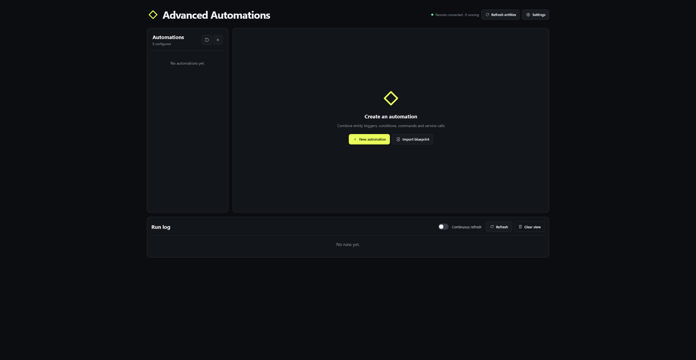
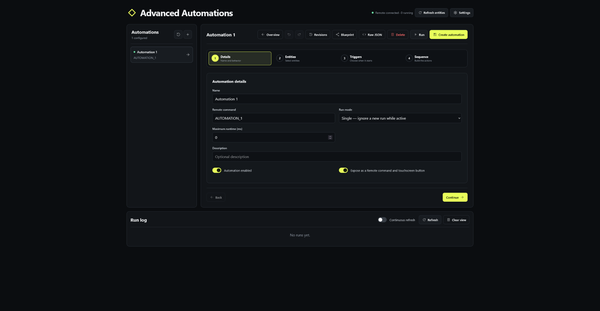
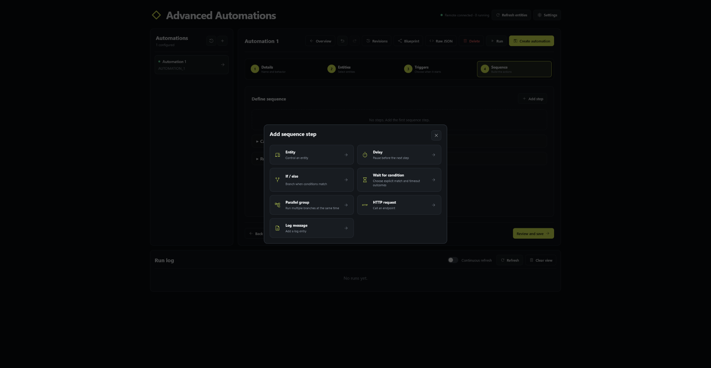

<!-- Advanced Automations v2.0.0 -->
# Advanced Automations

Advanced Automations is a local visual automation engine for **Unfolded Circle Remote Two** and **Remote 3**. It can run directly on a Remote as an ARM64 custom integration or as an external container managed by an external integration installer.

The integration combines entity triggers, conditions, commands, schedules, waits, HTTP requests, recovery behavior and persistent diagnostics in one workflow editor.

## v2 architecture

Advanced Automations v2 uses **ucapi-framework 1.9.6** for Integration-API lifecycle handling and entity abstractions, and **Unfurled 0.5.0** for authenticated Remote Core REST/WebSocket communication.

- `ucapi-framework` owns the `IntegrationAPI` instance and standard Remote lifecycle/event handling.
- Generated Remote and Sensor entities use the framework entity base classes.
- `Unfurled` owns REST authentication, API-key rotation, Remote Core REST operations and the reconnecting WebSocket transport.
- `CoreClient` remains as a narrow application adapter so the automation engine, trigger manager and web editor are independent from transport-library internals.
- The automation engine, database, configuration store and editor remain application-owned domain components.

See [`docs/ARCHITECTURE.md`](docs/ARCHITECTURE.md) for the detailed boundary between the framework, Unfurled and the automation domain layer.

## Screenshots

### Automation dashboard



### Guided automation editor



### Sequence step picker



## Automation editor

Selecting an existing automation opens its overview. Select **Edit** to enter the guided configuration flow.

### 1. Automation details

Configure:

- Name and description
- Enabled or disabled state
- Optional Remote command and touchscreen exposure
- Run mode:
  - **Single:** ignore another start while the automation is active
  - **Replace:** cancel the active run and start again
  - **Parallel:** allow simultaneous runs
- Optional maximum runtime
- Cancellation cleanup sequence
- Rollback sequence

### 2. Choose entities

The compact entity dropdown contains all entities reported by the Remote. It supports:

- Search
- Entity-type filters
- Source-integration filters
- Select-visible and clear-unused actions
- Protection for entities already referenced by the automation

Sensors can be selected for triggers and conditions but are not available as command targets.

### 3. Define triggers

Trigger cards are collapsible and can be reordered with drag and drop.

Supported trigger types:

- Entity state transition
- Entity remains in a state for a duration
- Numeric threshold crossing with optional hysteresis
- Any entity attribute change or one selected attribute change
- Scheduled local time with weekday selection
- Periodic interval
- Remote reconnect or integration startup
- Local webhook
- Completion or failure of another automation
- Manual virtual button

Trigger behavior can be configured as:

- **Start when any enabled trigger matches**
- **Start when the changed trigger matches and all configured target states are currently true**

### 4. Define sequence

Sequence cards are collapsible, support drag-and-drop ordering and can contain nested branches.

Available step types:

- **Entity:** send a supported command to a controllable entity
- **Delay:** pause for a fixed duration
- **If / else:** evaluate entity or time conditions and run a branch
- **Wait for condition:** wait for a condition with explicit match and timeout outcomes
- **Parallel group:** run multiple branches concurrently and wait for all or any branch
- **HTTP request:** call an HTTP or HTTPS endpoint
- **Log message:** write a diagnostic run event

## Wait for condition

A wait step defines:

- Conditions and whether every or any condition must match
- Timeout and polling interval
- Time reference:
  - From the automation trigger
  - From when the wait step begins
- When the condition matches:
  - Continue the sequence
  - Stop successfully
  - Run a match branch
- When the timeout expires:
  - Continue the sequence
  - Stop successfully
  - Fail the automation
  - Run a timeout branch

Example:

> Wait up to 10 seconds from the trigger for playback to resume. If playback resumes, stop successfully. If the timeout expires, continue with the remaining sequence.

## Execution policies

Command, condition, wait, parallel, HTTP and log steps support structured failure handling:

- Per-step timeout
- Retry count
- Retry delay
- Fixed or exponential retry backoff
- Continue, fail, rollback or run a failure branch after the final failure

Automation-level controls include:

- Maximum runtime
- Parallel sequence groups
- Cancellation cleanup steps
- Rollback steps

## Automation overview and persistent history

The overview shows the complete trigger and sequence timeline together with persistent execution information:

- Last run
- Last successful run
- Last failure
- Average duration
- Recent run history
- Currently active step

Run history, step progress and diagnostic events are stored in `automation-data.sqlite3` and survive service restarts. Runs left active by an unexpected restart are marked as cancelled.

The run log is refreshed only when **Refresh** is selected or **Continuous refresh** is enabled.

## Revisions, undo and rollback

Before a persisted automation is updated, deleted, restored or replaced through the raw editor or blueprint import, the previous state is saved as a revision.

- Up to 50 revisions are retained per automation
- Revisions record the timestamp, action and source:
  - Visual editor
  - Raw editor
  - Blueprint import
  - Rollback
- Revisions can be compared as formatted JSON
- Any retained revision can be restored
- Deleted automations remain available in the deleted-automation archive and can be recreated with their original identifier
- The visual editor and raw JSON editor each provide local undo and redo controls before saving

## Automation blueprints

Blueprint exports contain the automation template only. They do not attach or export entity records from the source installation.

Every entity reference in a trigger, condition, command, failure branch, wait branch, parallel branch, cancellation sequence or rollback sequence is replaced with its own placeholder. During import, the user must select a local entity for every placeholder before the automation can be created.

Blueprints never contain API keys, Remote connection settings or other installation credentials.

## Raw JSON editor

JSON is the integration's native persisted automation format. The raw editor therefore uses JSON rather than YAML, avoiding implicit YAML type conversion and keeping visual and raw representations identical.

The raw editor provides:

- Formatting and syntax validation
- Undo and redo
- Structured server-side validation when saved
- Revision creation with `raw_editor` as the edit source

## Last automation triggered sensor

The integration exposes a read-only sensor named **Last automation triggered**. Its value updates whenever an automation run is accepted from a trigger, the Remote or the web interface. The last value is restored from persistent run history after restart.

## Remote authentication setup

During integration setup:

1. Enter the Remote address.
2. Enter the current Web Configurator PIN.
3. Unfurled authenticates as `web-configurator` and creates an `admin`-scoped persistent `Advanced Automations` API key.
4. If a key with that name already exists, Unfurled safely replaces it before issuing the new secret.
5. The returned one-time API key is stored in the private configuration file.
6. The submitted PIN is discarded and never persisted.

When reconfiguring the same Remote, an empty PIN retains the existing API key. Entering a PIN rotates the persistent key.

## External service installation

Runtime behavior:

- Host networking for direct Remote access
- Persistent configuration mounted at `/config`
- Integration API port assigned in the reserved range
- Web editor starting at port **9201** and scanning upward if occupied
- Integration discovery publishing disabled by default for managed external containers

After installation, open:

```text
http://SERVER-IP:9201
```

The selected editor port is written to:

```text
/config/web-port.txt
```

### Docker Compose

```bash
docker compose up -d --build
```

## Custom integration package

Build the ARM64 package in an ARM64 environment or through GitHub Actions. The included workflow uses GitHub's native `ubuntu-24.04-arm` runner and the official `r2-pyinstaller` image, avoiding QEMU emulation:

```bash
bash ./tools/build_remote.sh aarch64
```

The generated archive uses this pattern:

```text
uc-intg-advanced-automations-v2.0.0-aarch64.tar.gz
```

Verify an archive before installation:

```bash
bash ./tools/verify_remote_archive.sh ./uc-intg-advanced-automations-v2.0.0-aarch64.tar.gz
```

The Python wheel is for external/server deployment and is not a custom-integration archive.

## Web API

| Method | Endpoint | Purpose |
|---|---|---|
| `GET` | `/api/health` | Container liveness and service diagnostics |
| `GET` | `/api/status` | Connection, trigger and run status |
| `GET` | `/api/entities` | Available entities and current attributes |
| `GET` | `/api/entities/{id}/commands` | Command metadata for an entity |
| `GET` | `/api/automations` | Automations and persistent history summaries |
| `POST` | `/api/automations` | Create an automation |
| `PUT` | `/api/automations/{id}` | Update an automation |
| `DELETE` | `/api/automations/{id}` | Delete and archive an automation |
| `POST` | `/api/automations/{id}/run` | Start an automation |
| `GET` | `/api/automations/{id}/history` | Persistent history and current step |
| `GET` | `/api/automations/{id}/revisions` | Retained revisions |
| `POST` | `/api/automations/{id}/revisions/{revision}/restore` | Restore a revision |
| `GET` | `/api/revisions/deleted` | Deleted-automation archive |
| `POST` | `/api/revisions/{revision}/restore-deleted` | Restore a deleted automation |
| `POST` | `/api/triggers/{trigger}/run` | Run a manual trigger |
| `POST` | `/api/webhooks/{webhook}` | Run matching webhook triggers |
| `GET` | `/api/logs` | Persistent run events |
| `POST` | `/api/integration/refresh` | Refresh generated entities and commands |

Invalid automation payloads return HTTP `400` with JSON-safe field details instead of an internal-server-error response.

## Persistent storage

`config.json` contains connection settings and automation definitions. It is written atomically and, where supported by the filesystem, uses mode `0600`.

`automation-data.sqlite3` contains run history, run events and automation revisions. SQLite WAL mode is enabled for durable local access.

Corrupt or incompatible JSON configurations are backed up and recovered. Valid automations are salvaged individually where possible.

## Development

Install runtime dependencies and run the public validation suite:

```bash
python -m pip install -r requirements.txt
make test
```

The public validation suite compiles the Python sources, imports the package, checks version and driver metadata, verifies packaged frontend assets, and validates every JavaScript module. If a private `tests/` directory is present locally, `make test` discovers and runs it automatically after the public checks.

Build the external wheel:

```bash
python -m pip wheel . --no-deps --no-build-isolation -w dist
```

## License

Released under the [MIT License](LICENSE).
